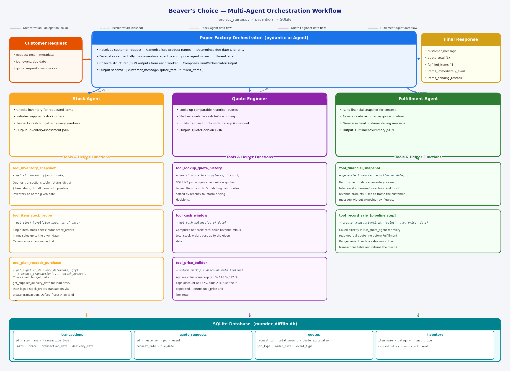

# Multi-Agent Workflow

This repository contains my project submission for the Agentic AI nanodegree program of Udacity. 

## Brief description

A multiagent workflow is implemented to process customer requests.

An orchestrator agent analyzes customer requests and coordinates specialized worker agents by calling them sequentially to check inventory stock status, calculate the quote (price) for the requested items, and order restock if necessary.

### Workflow run terminal output

## Project contents

### 1. Workflow Overview

**Workflow diagram:** 

Customer inquiries enter through the **Paper Factory Orchestrator** agent, which maps requests to catalog SKUs and coordinates the specialized worker agents by calling them sequentially as tools.

**Data flow summary:**
- The Orchestrator maps the customer request to up to four catalog SKUs and calls `run_inventory_agent`.
- Stock Agent checks stock levels per item and places future-dated supplier purchase orders for shortfalls within cash limits.
- Quote Agent builds priced lines using historical context, current cash, and `tool_price_builder`; a deterministic patch step corrects LLM output before returning. Sales for immediately available items are recorded at this stage via `tool_record_sale`.
- Fulfillment Agent receives the ready quote lines, calls `tool_financial_snapshot`, and composes a customer message that covers confirmed items, backorder ETAs, and delivery commitments — without exposing internal cash figures or margins.

### 2. Testing the workflow

`project_starter.py` includes `run_test_scenarios()`, which processes all rows in `quote_requests_sample.csv` through the four-agent workflow and outputs final balances and customer responses to `test_results.csv`. Execution depends on the Udacity/Vocareum API key since all agents use `pydantic-ai` with OpenAI connectivity. (Configure `UDACITY_OPENAI_API_KEY` in `.env` then run `python project_starter.py`.)

### 3. Ideas for Improvement
- **Use a partially nonlinear workflow** - this would speed up the processing. For example the quote calculation or restock planning for separate items can be processed simultaneously.
- **Handle transactions and cash balance more systematically**
